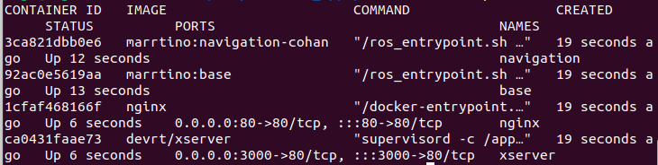
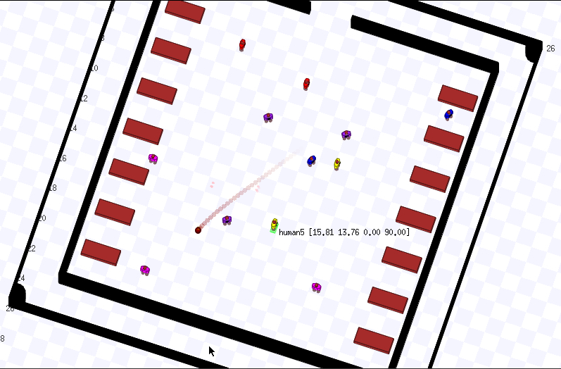

# Autonomous Robots as a Resource for Mass Epidemic Sustainability assisting in critical care wards

This is the repository devoted to the *Master Thesis*. 

The goal is to implement robots as acting remote interface for physicians at home in smart-working mode, to perform diagnostic tasks that do not require high precision manual interactions, and therefore decreasing the workload of physically available operators in critical care wards. 

## Prerequisites

Make sure to have ```marrtino_apps``` and ```stage_environments``` in ```$HOME/src```.

To get up-to-date version, enter cloned repository and execute:

```
git pull
```

## Compile and run the project

### Using the Manual Launch

**1. Open terminal, navigate to ```MARRTINO_APPS_HOME/docker```, and start the docker:**

```
cd $MARRTINO_APPS_HOME/docker
./start_docker.bash

```
As the result, docker containers must start as in the image below. If it didn't happen, run ```tmux a``` and check ```marrtino up``` tab for the presence of errors.

<p align="center">
  
</p>

**2. In a browser open ```http://localhost``` and follow ```Bringup``` link. Press ```CONNECT```.**

**3. Return to the terminal and run the docker image for the ```stage``` simulator as ```docker exec -it stage tmux```. Then in the opened ```tmux``` window execute the desired stage:**.

```
cd src/stage_environments/scripts
python start_simulation.py ER_planfloor_new

``` 
Stage consists of ```stage_name.yaml```, ```stage_name.png``` (or another image extension) and ```include``` folder. Relevant locations to store these files are:
- ```~/playground/maps```
- ```~/src/marrtino_apps/mapping/maps```
- ```~/src/stage_environments/maps```

The full set of maps used for testing is stored in [```maps```](https://github.com/olga-sorokoletova/Master-Thesis/blob/main/playground/maps).

Expected result:

<p align="center">
  
</p>

To quit the simulation, use:

```
rosrun stage_environments quit.sh
```

**4. Open one more terminal window and run docker image for navigation as ```docker exec -it navigation tmux a```.**

In a ```tmux``` window's bottom pannel go to:

**- 1. ```0:loc``` to start the ```localization```:**

```
cd ../navigation
python startloc.py ER_planfloor_new [<x> <y> <a_deg>]
```

```<x> <y> <a_deg>``` are the 0, 1 and 3 coordinates of the robot pose, respectively. And for a ```ER_planfloor_new``` map their default is ```17 20 180```. Otherwise, see these coordinates in a ```stage``` window.

**- 2. ```2:obst``` to start human tracking.**

Make sure that [```humans_bridge.py```](https://github.com/olga-sorokoletova/Master-Thesis/blob/main/stage/humans_bridge.py) is copied to the ```marrtino_apps/stage``` and run:

```
cd ../stage
python human_bridge.py nh
```
where ```nh``` is a number of humans in the semantic map, e.g. ```12``` for the ```ICU2``` map.

To check that ```/tracked_humans``` topic is being published, run from another tab:

```
rostopic echo /tracked_humans
```

**- 3. ```1:nav``` to start the ```navigation``` itself. For example:**

```
cd ../navigation
roslaunch [move_base.launch | cohan_nav.launch]
```

```cohan_nav.launch``` is a ```move_base``` node for [**Co-operative Human Aware Navigation (CoHAN) Planner**](https://github.com/sphanit/CoHAN_Planner#co-operative-human-aware-navigation-cohan-planner).

**- 4. ```4:rviz``` to launch ```rviz```:**

```
cd ../navigation
rosrun rviz rviz -d nav.rviz
```

Through ```rviz``` fix ```2D Pose Estimate```, check that the correct map is chosen and then set the navigation goal using ```2D Nav Goal```. Observe the motion in both ```rviz``` and ```stage```.

### Using the Autostart Scripts

**1. The same as before: open terminal, navigate to ```MARRTINO_APPS_HOME/docker```, and start the docker:**

```
cd $MARRTINO_APPS_HOME/docker
./start_docker.bash
```

**2. Now navigate to the ```start``` folder and launch authomatic start:**


```
cd ../start
python3 autostart.py ER_start.yaml
```
Take care of map ```.yaml```, ```.png``` and ```include``` folder be present in the ```$HOME/playground/maps```.

To stop the modules inside the containers (but not the containers):

```
python3 autostart.py ER_start.yaml --kill
```

## PROGRAMMING MARRTINO

## 1. Semantic navigation 

### 1. The semantic maps:  for the Emergency Department floor - [ER_planfloor_new.yaml](https://github.com/olga-sorokoletova/Master-Thesis/blob/main/playground/maps/ER_planfloor_new.yaml), for the ICU (Intensive Care Unit) - [ICU.yaml](https://github.com/olga-sorokoletova/Master-Thesis/blob/main/playground/maps/ICU.yaml), [ICU2.yaml](https://github.com/olga-sorokoletova/Master-Thesis/blob/main/playground/maps/ICU2.yaml) and [sample_new.yaml](https://github.com/olga-sorokoletova/Master-Thesis/blob/main/playground/maps/sample_new.yaml).

Semantic information:
- **doors**, **indoors** and **outdoors** for the 4 top-right rooms in the map = assumed offices for 4 doctors,
- **home** = assumed location of the charging station, 
- **beds** in the corridors (since it's a property of the ED), implemented as boxes,
- **telecom** = assumed room where telecommunication with a physician at home can be performed,
- 6 categories of **people** inspired by the map from [here](https://kierantimberlake.com/updates/report-from-the-studio-mapping-jefferson-hospitals-emergency-department/).

### 2. Prototypic database: [providers.csv](https://github.com/olga-sorokoletova/Master-Thesis/blob/main/playground/providers.csv).
It has three fields:
- **name** of the doctor (for now, they are just "provider1", ..., "provider4"),
- **office** of the doctor ("1",..."4" in a correspondence to 4 top-right rooms in the map),
- **status** of the doctor ("home" = doctor is available in a smart-working mode today, "hospital" = doctor is working in the hospital, "NA" - doctor is not available)

### 3. Script:  [create_nav_cmd.py](https://github.com/olga-sorokoletova/Master-Thesis/blob/main/playground/create_nav_cmd.py).
This script is executed outside the containers, and the command to execute this script is: 

```
cd ~/playground/
python3 create_nav_cmd.py "provider1"

```
where instead of ```"provider1"``` can be any name of the doctor who is present in the database.

It checks what is the status of the requested doctor, and:
- if he is not available => simply informs,
- otherwise => creates a file [```er_cmd.nav```](https://github.com/olga-sorokoletova/Master-Thesis/blob/main/navigation/er_cmd.nav) inside the ```marrtino_apps/navigation``` folder to be executed as:

```
python nav.py er_cmd.nav. 

```
This file contains just one command: ```gotoLabel(target_location)```, where ```target_location``` can be: 1) "telecom", if status is "home", or 2) outdoors of the doctor's office if status is "hospital". 

## 2. Getting and setting poses for humans in the stage 

### 1. Using ROS

Display the list of topics in one of the free tabs of navigation container while running navigation:
```
rostopic list
```
5 topics are being published for each of the humans. For example, for the human named in a semantic map as ```human1``` their names are:
```
/human1/base_pose_ground_truth
/human1/cmd_vel
/human1/odom
/human1/setpose
/human1/stage_say
```
To listen to a particular topic, use:
```
rostopic echo /topic_name

#or to read just one message
rostopic echo -n 1 /topic_name
```
To know the type of the message, use:
```
rostopic type /topic_name
```
To publish message to a topic, use publisher:
```
rostopic pub /topic_name /topic_type  /message
```
To move a human, publish to its ```/cmd_vel``` topic message with a new velocity. For example (use double tab to autocomplete the message structure):
```
rostopic pub /human1/cmd_vel geometry_msgs/Twist  '{linear:  {x: 1.0, y: 1.0, z: 0.0}, angular: {x: 0.0,y: 0.0,z: 0.0}}'
```
As the result, observe the ```human1``` moving forward.

### 2. Using Python

Use one of the free tabs of navigation container while running navigation to execute the scripts, mentioned below.

2.1. To get the pose of the ```human1```:
```
python getpose.py human1
```
2.2. To set the pose of the ```human1```:
```
python setstagepose.py <x_new> <y_new> <a_deg_new> human1
```
As the result, ```human1```'s pose is changed accordingly.

2.3. To move human continuously along ```x``` axis using custom script [move_obstacle.py](https://github.com/olga-sorokoletova/Master-Thesis/blob/main/navigation/move_obstacle.py):

```
python move_obstacle.py human1 <x_human1> <y_human1> <a_deg_human1> <x_new_human1>
```
```<x_human1> <y_human1> <a_deg_human1>``` are the initial coordinates of the ``human1`` pose, and ```<x_new_human1>``` is a desired coordinate of the ```human1``` on ```x``` axis.

## Authors
- Olga Sorokoletova - 1937430
- Matteo Matera - 1795339
